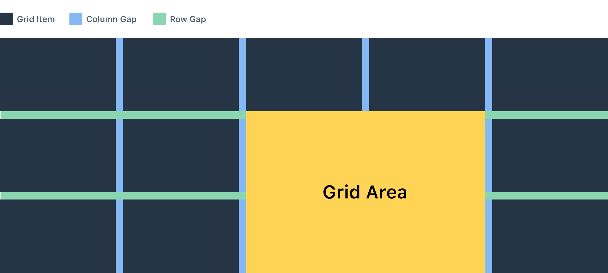
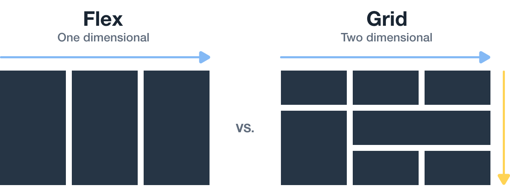

[CSS Grid](https://developer.mozilla.org/en-US/docs/Glossary/Grid) based React component, comes with predefined values to ensure design consistency, and ease of use.

## How to use Grid

The Grid consists of two components:

- Grid: Used as a container for GridItems
- GridItem: Elements within the Grid

## Code examples

### columns

When defined as a number, it will split the space into equally sized columns; it also accepts any of the [grid-template-columns](https://developer.mozilla.org/en-US/docs/Web/CSS/grid-template-columns) css properties. e.g.

```jsx
// import { Grid, GridItem } from '@contenful/forma-36-react-components';

<React.Fragment>
  <Grid columns={6}></Grid>
  <Grid columns={'auto 1fr'}></Grid>
</React.Fragment>
```

### rows

Accepts a number or any of [grid-template-rows](https://developer.mozilla.org/en-US/docs/Web/CSS/grid-template-rows) css properties.

```jsx
// import { Grid, GridItem } from '@contenful/forma-36-react-components';

<React.Fragment>
  <Grid rows={6}></Grid>
  <Grid rows={'auto 1fr'}></Grid>
</React.Fragment>
```

### columnGap & rowGap

`columnGap` represents space between columns, `rowGap` represents the space between rows, both accepts one of [spacing](https://f36.contentful.com/foundation/spacing/) token names.

`spacing2Xs` | `spacingXs` | `spacingXs` | `spacingS` | `spacingM` | `spacingL` | `spacingXl` | `spacing2Xl` | `spacing3Xl` | `spacing4Xl`

**e.g.**

```jsx
// import { Grid, GridItem } from '@contenful/forma-36-react-components';

<Grid columnGap="spacingXs" rowGap="spacingXl"></Grid>
```

<br />

## Grid Components

The grid layout consists of different components that helps defining your layout in two dimensional aspects, these components are:

**Grid container:** The main element that controls the layout structure, columns, rows, and the gap between them

**Grid item:** The children of the grid container.

**Grid columns:** The vertical container for children elements within the grid layout

**Grid rows:** The horizontal container for elements within the grid layout

**Grid area:** A space consists of columns and rows within the grid, and is controlled by the child element itself

**Column gap:** The space between vertical containers which corresponds to one of our [spacing](/foundation/spacing/) values

**Row gap:** The space between horizontal containers which also corresponds to one of our [spacing](/foundation/spacing/) values



<br />

## Basic usage

```jsx
<Grid columns="1fr 2fr" rowGap="spacingM" columnGap="spacingM">
  <GridItem style={{ backgroundColor: '#263545', height: '100px' }} />
  <GridItem style={{ backgroundColor: '#263545', height: '100px' }} />
  <GridItem style={{ backgroundColor: '#263545', height: '100px' }} />
  <GridItem style={{ backgroundColor: '#263545', height: '100px' }} />
  <GridItem style={{ backgroundColor: '#263545', height: '100px' }} />
  <GridItem style={{ backgroundColor: '#263545', height: '100px' }} />
  <GridItem style={{ backgroundColor: '#263545', height: '100px' }} />
  <GridItem style={{ backgroundColor: '#263545', height: '100px' }} />
</Grid>
```

<br />

## Repeat notation

`repeat()` is a css notation that you can use with the `gridColumns` and `girdRows` properties to make your rules more concise and easier to understand when creating a large amount of columns or rows

**Example:** `gridColumns={'1fr 2fr 1fr 2fr 1fr 2fr'}` is same as `gridColumns={'repeat(3, 1fr 2fr)'}` see below.

```jsx
<div>
  <Grid columns="1fr 2fr 1fr 2fr 1fr 2fr" columnGap="spacingM">
    <GridItem style={{ backgroundColor: '#263545', height: '100px' }} />
    <GridItem style={{ backgroundColor: '#263545', height: '100px' }} />
    <GridItem style={{ backgroundColor: '#263545', height: '100px' }} />
    <GridItem style={{ backgroundColor: '#263545', height: '100px' }} />
    <GridItem style={{ backgroundColor: '#263545', height: '100px' }} />
    <GridItem style={{ backgroundColor: '#263545', height: '100px' }} />
  </Grid>

  <Grid
    columns="repeat(3, 1fr 2fr)"
    columnGap="spacingM"
    style={{ marginTop: '24px' }}
  >
    <GridItem style={{ backgroundColor: '#0C141C', height: '100px' }} />
    <GridItem style={{ backgroundColor: '#0C141C', height: '100px' }} />
    <GridItem style={{ backgroundColor: '#0C141C', height: '100px' }} />
    <GridItem style={{ backgroundColor: '#0C141C', height: '100px' }} />
    <GridItem style={{ backgroundColor: '#0C141C', height: '100px' }} />
    <GridItem style={{ backgroundColor: '#0C141C', height: '100px' }} />
  </Grid>
</div>
```

<br />

## FR unit

Fr is a fractional unit and 1fr is for 1 part of the available space. it differs from percentage unit because it distributes available space.

If you place a larger item into a track then the way the fr until will work is to allow that track to take up more space and distribute what is left over.

```jsx
<Grid columns={'1fr 1fr 1fr'}>
  <p style={{ border: '1px solid #263545' }}>
    WelcomeToTheAwesomeContentfulGridSystem
  </p>
  <p style={{ border: '1px solid #263545' }}>Contentful</p>
  <p style={{ border: '1px solid #263545' }}>Forma 36</p>
  <p style={{ border: '1px solid #263545' }}>
    Welcome To The Awesome Contentful Grid System
  </p>
  <p style={{ border: '1px solid #263545' }}>Contentful</p>
  <p style={{ border: '1px solid #263545' }}>Forma 36</p>
</Grid>
```

<br />

## Span keyword

Span keyword works on grid items with the `gridArea` property, use `span` to avoid specifying the end lines for a column or a row.

i.e. instead of specifying `columnStart` and `columnEnd` you can use span to make the grid item take 4 columns

```jsx
<Grid columns={6}>
  <GridItem style={{ backgroundColor: '#263545', height: '100px' }} />
  <GridItem
    area={'span 4 / span 4'}
    style={{ backgroundColor: '#263545', height: '100px' }}
  />
</Grid>
```

<br />

## Content alignment

Just like flexbox the grid comes with `justifyContent`, `justifyItems`, `alignItems`, `alignContent`, ..etc.

```jsx
<Grid columns={'250px 250px'} justifyContent={'space-between'}>
  <GridItem style={{ backgroundColor: '#263545', height: '100px' }} />
  <GridItem style={{ backgroundColor: '#263545', height: '100px' }} />
</Grid>
```

<br />

## Grid vs. Flexbox

The main difference between CSS Grid Layout and CSS Flexbox Layout is that flexbox was designed for layouts in one dimension - either a row or a column.
Grid was designed for two-dimensional layout rows, and columns.



<br />

## Accessibility

According to [WCAG C27](https://www.w3.org/TR/WCAG20-TECHS/C27.html) technique, the dom order must match the visual order.

The grid can re-order it's content in various ways through the order css property on grid items, this changes the visual order but the dom order stays the same, hence,
keyboard navigation and focus order maybe affected.

Set the correct order of the elements with `tabindex` attribute to avoid accessibility issues.
