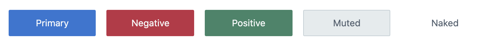
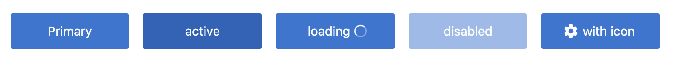
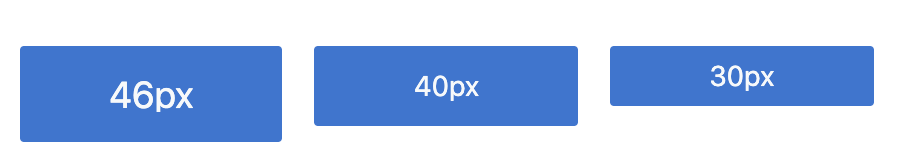

# Button

Buttons communicate the action that will occur when the user clicks them. They communicate calls to action to the user and allow users to interact with pages in a variety of ways. They contain a text label to describe the action, and an icon if appropriate.

## Button types

- **Primary** - Used for the most important actions in any scenario. Don’t use more than one primary button in a section or screen to avoid overwhelming users.
- **Muted** - Used for a secondary actions, the most commonly used button type.
- **Positive** - For use when the action has a positive connotation such as creating or publishing a new entity.
- **Negative** - For destructive actions - when something can't be undone. For example, deleting entities.
- **Naked** - Link button




## Button variations



Contentful buttons are available in 3 different sizes: large, default and small




## Examples of usage

```jsx
import {Button} from '@contentful/forma-36-react-components';

<Button buttonType="primary" data-test-id="create-content-type-empty-state">Add content type</Button>

```
Contentful react button will be renderd as:

```html
<button data-test-id="create-content-type-empty-state" class="Button__Button___1ZfFj a11y__focus-border--default___60AXp Button__Button--primary___JImeO" type="button">
  <span tabindex="-1" class="TabFocusTrap__TabFocusTrap___39Vty Button__Button__inner-wrapper___3qrNC">
   <span class="Button__Button__label___3tcOj">
    Add content type
   </span>
  </span>
</button>
```

Buttons  can be used in different contexts in your project. You might want to use it for dropdowns or display icons inside of the button.
Example of usage of button in the Contentful dropdown:

```jsx
import {Dropdown, DropdownList, DropdownListItem, Button} from @contentful/forma-36-react-components

<Dropdown
  onClose={() => setOpenActions(false)}
  isOpen={openActions}
  toggleElement={
     <Button
      indicateDropdown
      testId="content-type-actions"
      onClick={() => {setOpenActions(!openActions)}}
      buttonType="muted"
      >
         Actions
      </Button>
  }>
    <DropdownList>
    <DropdownListItem>
       Duplicate
    </DropdownListItem>
    <DropdownListItem>
     Delete
    </DropdownListItem>
  </DropdownList>
</Dropdown>
```


## Content recomentations:

 - UI usage - Button labels should be no longer than 3 words
 - Webpage usage - Button labels should be no longer than 5 words
 - Start labels with action verbs. If the button is part of an action dialog, make sure it matches the dialog header.
 - Use specific words, ideally ones that align with preceding content.
 - For buttons that are used to cancel destructive actions: label them "Never mind" or similar, instead of cancel. It makes things much easier for users to understand.

## Best practices

- Use clear, succinct, and accurate labels
- Start button labels with verbs, for example "Add field", not "New field"
- Position buttons in consistent places in the interface
- Reduce complexity by using a small number of actions. Too many actions can create confusion when having to decide

## Properies overview:

|Prop|Description|
|-|-|
|`icon`| string, optional, one of IconType |
|`indicateDropdown`| boolean, optional, adds cheveron icon on the right side of the button |
|`onClick`| optional, MouseEventHandler |
|`isFullWidth`| boolean, optional, sets width to 100% |
|`loading`| boolean, optional, sets loading state with spinner |
|`disabled`| boolean, optional, sets disable state |
|`isActive`| boolean, optional, sets active state |
|`onBlur`| optional, FocusEventHandler |
|`testId`| string, optional, additional attibute for testing pursposes |
|`buttonType`| string, optional, one of `primary` `positive` `negative` `warning` `muted` `naked`, default `primary` |
|`type`| string, optional, one of `button` `submit` `reset`, default `button` |
|`size`| string, optional, one of `small` - 30px, default 40px, `large` - 46px |
|`href`| string, optional, href prop, it also transforms button into <a> |
|`style`| optional, CSSProperties |
|`className`| string, optional, class names to be appended to the className prop of the component |
|`children`| React.ReactNode, optional, child nodes to be rendered in the component |
