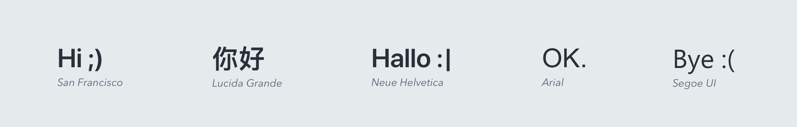

import typfaceImg from './assets/typeface.png';

Typography is much more than choosing pretty fonts, it’s a very important components in UI design, Good typography establishes a strong, cohesive visual hierarchy that helps to present content clearly and efficiently.

## Typeface
Forma strives for a performant, clean experience to our users, hence, we chose our font stack to match the system fonts that already comes preloaded with the OS on your device.
These are the font stack we use in our systems...

Our font stack comes in multiple values, each value correspond to a font type based on the running operating system, below describes the values, and the fonts it corresponds to: 

-apple-system, BlinkMacSystemFont, Segoe UI, Helvetica, Arial, sans-serif, Apple Color Emoji, Segoe UI Emoji, Segoe UI Symbol

| Value | Font & Device |
| ---- | - |
| **--apple-system** | San Francisco on Safari (Mac & iOS) `Neue Helvetica` and `Lucida Grande` on older versions of Mac OS X |
| **Segoe UI** | Targets Windows and Windows Phone. |
| **BlinkMacSystemFont** | Represents the default UI for Chrome on Mac OS X |

* **system-ui** Represents the default UI font on any given platform. `BlinkMacSystemFont` is the equivalent for Chrome on Mac OS X.
* **Segoe UI** Targets Windows and Windows Phone.
* **Arial** Available on a wide range of devices

<!-- Export is required for components by mdx -->
export default ({ children }) => (
  <>
    {children}
  </>
)