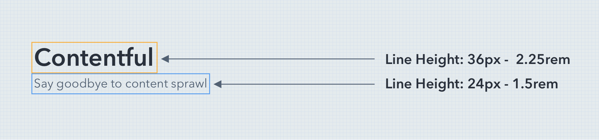

import fontBaseTokens from '@contentful/forma-36-tokens/src/tokens/typography/font-base';
import fontSizeTokens from '@contentful/forma-36-tokens/src/tokens/typography/font-size';
import fontWeightTokens from '@contentful/forma-36-tokens/src/tokens/typography/font-weight';
import lineHeightTokens from '@contentful/forma-36-tokens/src/tokens/typography/line-height';
import fontStackTokens from '@contentful/forma-36-tokens/src/tokens/typography/font-stack';
import letterSpacingTokens from '@contentful/forma-36-tokens/src/tokens/typography/letter-spacing';
import {
  Card,
  Typography,
  Paragraph,
  Heading,
  Subheading,
  SectionHeading,
  DisplayText,
  Table,
  TableHead,
  TableBody,
  TableCell,
  TableRow
} from '@contentful/forma-36-react-components';

Typography is a foundational element in UI design. Good typography establishes a strong, cohesive visual hierarchy which functions to present content clearly and efficiently to users.

 

## Typeface
Forma 36 enables users to create clean, efficient user interfaces that utilize system UI fonts.

System UI font family:

Forma 36 uses system UI fonts. System UI fonts refer to the fonts used to render text in the UI of an operating system. When used on the web they offer familiarity, load with zero-latency, and support a wide number of character sets.

**San Francisco** appears on Safari (Mac OS X and iOS); **Neue Helvetica** and **Lucida Grande** appears on older versions of Mac OS X; 
**Segoe UI** targets Windows and Windows phone; **Arial** is available on almost all operating systems.

### Tokens

<Table className="f36-margin-bottom--l">
  <TableHead>
    <TableRow>
      <TableCell>Token</TableCell>
      <TableCell>Example</TableCell>
      <TableCell>CSS Variable</TableCell>
      <TableCell>Value</TableCell>
    </TableRow>
  </TableHead>
  <TableBody>
    {Object.keys(fontStackTokens).map(token => {
      const value = fontStackTokens[token];
      return (
        <TableRow key={token}>
          <TableCell>{token}</TableCell>
          <TableCell>
            

              Manage content better with infrastructure. It’s the cure for the
              common CMS. Update once and publish everywhere, so teams build
              digital products faster.
            

          </TableCell>
          <TableCell>
            <pre>--{token}</pre>
          </TableCell>
          <TableCell>
            <pre>{value}</pre>
          </TableCell>
        </TableRow>
      );
    })}
  </TableBody>
</Table>

 

## Font sizes
We use **rem** units to define our font sizes because they are direct and simple to maintain.

### What are **rem**?
**rem** (root em) are simply a ratio of the root element font size. The root element is the browser default font size 16px. EX: (1rem = 16px) and (2rem = 32px).

Using **rem** units enables our system to scale up and down based on user preference.

 

### Available Sizes

 
<SectionHeading>Section Heading</SectionHeading>

*Section Heading* is intended to be used as a title for a widget, and is most commonly used in the sidebar.

Font size: **12px** = **0.75rem** - Line Height: **18px** = **1.125rem**  - Weight: **600**

 

<Paragraph>Body</Paragraph>

*Body* is the base font size for content. It is intended to be used as paragraph copy.

Font size: **14px**=**0.875rem** - Line Height: **21px**=**1.313rem** - Weight: **500**

 

<Subheading>Subheading</Subheading>

*Subheadings* are intended to be used as headings for copy nested within a section. EX: a subheading under Contact may be Address or Phone number.

 Font size: **16px** = **1rem** - Line Height: **24px** = **1.5rem** - Weight: **700**

 

<Heading>Heading</Heading>

*Heading* is intended to be used to define a section. Headings are very important for accessibility, as it helps to make copy more easily scannable and guides a user through your content.

Another accessibility consideration screen readers. Visually impaired people often use screen readers, which find sections in your copy based on your heading hierarchy.

Font size: **21px** = **1.313rem** - Line Height: **31px** = **1.938rem** - Weight: **700**

 

<DisplayText>Display</DisplayText>

*Display* is intended to be used in the same cases as Display Text Large.

Font size: **28px** = **1.75rem** - Line Height: **35px** = **2.188rem** - Weight: **700**

 

<DisplayText size='large'>Display Large</DisplayText>

*Display Large* is intended to be used to display text in featured content, such as empty states, promotions, and more.

Avoid using Display Large as a replacement for headings. In these cases, use the Heading style.

Font size: **35px** = **2.188rem** - Line Height: **44px** = **2.75rem** - Weight: **700**

 

### Tokens

#### Font base

<Table className="f36-margin-bottom--l">
  <TableHead>
    <TableRow>
      <TableCell>Token</TableCell>
      <TableCell>CSS Variable</TableCell>
      <TableCell>Value</TableCell>
    </TableRow>
  </TableHead>
  <TableBody>
    {Object.keys(fontBaseTokens).map(token => {
      const value = fontBaseTokens[token];
      return (
        <TableRow key={token}>
          <TableCell>
            {token}
          </TableCell>
          <TableCell>
            <pre>--{token}</pre>
          </TableCell>
          <TableCell>
            <pre>{value}</pre>
          </TableCell>
        </TableRow>
      );
    })}
  </TableBody>
</Table>

#### Font sizes

<Table className="f36-margin-bottom--l">
  <TableHead>
    <TableRow>
      <TableCell>Token</TableCell>
      <TableCell>CSS Variable</TableCell>
      <TableCell>Value (rem)</TableCell>
      <TableCell>Value (px)</TableCell>
    </TableRow>
  </TableHead>
  <TableBody>
    {Object.keys(fontSizeTokens).map(token => {
      const value = fontSizeTokens[token];
      const valuePx = 1 * parseFloat(value) * 16; // 16 = REM base
      return (
        <TableRow key={token}>
          <TableCell>
            {token}
          </TableCell>
          <TableCell>
            <pre>--{token}</pre>
          </TableCell>
          <TableCell>
            <pre>{value}</pre>
          </TableCell>
          <TableCell>
            <pre>{valuePx}px</pre>
          </TableCell>
        </TableRow>
      );
    })}
  </TableBody>
</Table>

 

### Line height

Line height can be described as a vertical padding around letters on each line.

The Forma 36 line height is defined by rem, which forces the line height to correspond to the root font size.

### Tokens

<Table className="f36-margin-bottom--l">
  <TableHead>
    <TableRow>
      <TableCell>Token</TableCell>
      <TableCell>Example</TableCell>
      <TableCell>CSS Variable</TableCell>
      <TableCell>Value</TableCell>
    </TableRow>
  </TableHead>
  <TableBody>
    {Object.keys(lineHeightTokens).map(token => {
      const value = lineHeightTokens[token];
      return (
        <TableRow key={token}>
          <TableCell>{token}</TableCell>
          <TableCell>
            

              Manage content better with infrastructure. It’s the cure for the
              common CMS. Update once and publish everywhere, so teams build
              digital products faster.
            

          </TableCell>
          <TableCell>
            <pre>--{token}</pre>
          </TableCell>
          <TableCell>
            <pre>{value}</pre>
          </TableCell>
        </TableRow>
      );
    })}
  </TableBody>
</Table>

### Consistency

To ensure each typeface is represented properly and the customer experience stays the same across different devices.

The base line grid assures that the Forma 36 typography system adapts flawlessly when typefaces, sizes, and weights are stacked together.

 

## Font weights

<Table className="f36-margin-bottom--l">
  <TableHead>
    <TableRow>
      <TableCell>Token</TableCell>
      <TableCell>CSS Variable</TableCell>
      <TableCell>Value</TableCell>
    </TableRow>
  </TableHead>
  <TableBody>
    {Object.keys(fontWeightTokens).map(token => {
      const value = fontWeightTokens[token];
      return (
        <TableRow key={token}>
          <TableCell>
            {token}
          </TableCell>
          <TableCell>
            <pre>--{token}</pre>
          </TableCell>
          <TableCell>
            <pre>{value}</pre>
          </TableCell>
        </TableRow>
      );
    })}
  </TableBody>
</Table>

 

## Letter-spacing

<Table className="f36-margin-bottom--l">
  <TableHead>
    <TableRow>
      <TableCell>Token</TableCell>
      <TableCell>Example</TableCell>
      <TableCell>CSS Variable</TableCell>
      <TableCell>Value</TableCell>
    </TableRow>
  </TableHead>
  <TableBody>
    {Object.keys(letterSpacingTokens).map(token => {
      const value = letterSpacingTokens[token];
      return (
        <TableRow key={token}>
          <TableCell>{token}</TableCell>
          <TableCell>
            
Contentful

          </TableCell>
          <TableCell>
            <pre>--{token}</pre>
          </TableCell>
          <TableCell>
            <pre>{value}</pre>
          </TableCell>
        </TableRow>
      );
    })}
  </TableBody>
</Table>

 

## Guidelines

### Use Forma 36 Sizes

To ensure consistency across user interfaces utilizing the Forma 36 design system, use available text styles from the Sketch UI kit.

### Color Contrast

[WCAG 2.1 Contrast Guideline](https://www.w3.org/TR/WCAG21/#contrast-minimum) recommends to have at least 4.5:1 contrast between your text color, and the background. 
Low color contrast may result indistinguishable elements on your screen, especially for people with color blindness.
